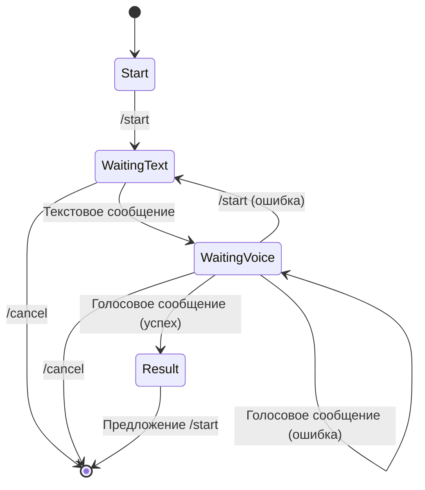
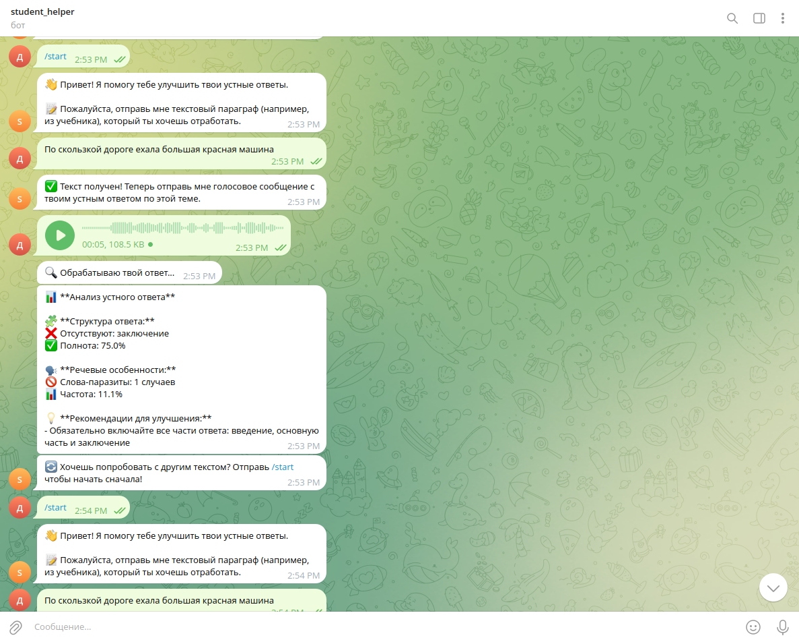

1.Пррблема: Трудность с самопроверкой пересказа
ЦА: Школьники, которым требуется помощь в проверке пересказа
2. идеи:Бот, принимающий исходный текст и голосовое сообщение и состовляющий фидбек по пересказу (полнота, структура, наличие слов паразитов)
сценарии: пользователь отправляет параграф мо биологии, после записывает голосовое сообщение содержащее пересказ этого параграфа, бот оценивает пересказ
3. 


```plaintext
speech-analyst-bot/
├── .env                    # Файл окружения (токены)
├── bot.py                  # Основной скрипт бота
├── audio_processor.py      # Обработка аудио
├── text_analyzer.py        # Анализ текста
├── report_generator.py     # Генерация отчетов
├── config.py               # Конфигурация
├── requirements.txt        # Зависимости
└── README.md               # Инструкции
```

4. ru_core_news_sm, openai/whisper-small, IlyaGusev/rut5_base_sum_gazeta
5. клонировать репозиторий, установить зависимости ($ pip install -r requirements.txt), указать телеграмм токен и huggingface токен в .env, запустить bot.py
6. 